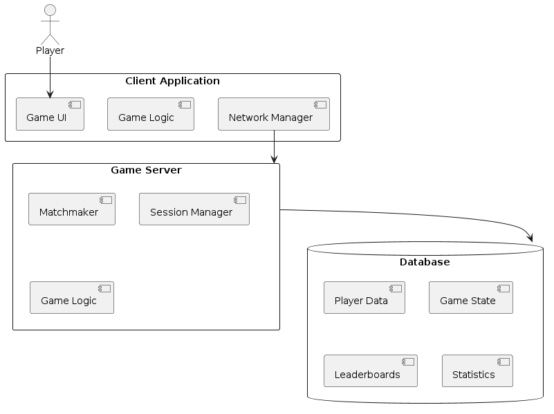

# High level design document

## Introduction

This High-Level Design (HLD) document provides a comprehensive overview of the
architecture for Project OMG, a 2D top-down, multiplayer, match-based game.
The document outlines the system architecture, major components, data flow,
technology stack, integration points, non-functional requirements, and
deployment strategy. The objective is to create a robust, scalable, and
maintainable game system that delivers an engaging multiplayer experience.

## Requirements

### Functional requirements

1. **Multiplayer support**:
   - The game must support multiplayer gameplay with players connecting from
     different PCs.

2. **Top-down 2D view**:
   - The game must have a top-down 2D view.

3. **Character lock on camera**:
   - The camera must stay locked on the player's character during gameplay.

4. **Match-based gameplay**:
   - The game must be match-based with no progression save between matches.

5. **Character creation**:
   - Players must be able to create characters, choosing from various classes
     and skills.

6. **Skill synergy**:
   - The game must support skill synergy (e.g., combining fire and poison skills
     to create different effects).

7. **PvPvE gameplay**:
   - The game must support both player versus player (PvP) and player versus
     environment (PvE) interactions.

8. **Intelligent bots**:
   - The game must include intelligent AI-controlled bots.

9. **Interactive environment**:
   - The game environment must include interactable elements such as
     destructible objects.

10. **End-game statistics**:
    - The game must display detailed statistics at the end of each match.

11. **Monitoring statistics throughout the game**:
    - The game must monitor and display statistics during gameplay.

### Non-functional requirements

1. **Performance**:
   - The game should target a frame rate of 60 FPS for smooth gameplay.
   - The system must ensure low-latency communication for real-time interactions.

2. **Scalability**:
   - The game architecture should handle an increase in the number of players
     and game sessions efficiently.

3. **Security**:
   - Player data must be protected against unauthorized access and breaches.
   - The system must include secure authentication and authorization mechanisms.

4. **Reliability**:
   - The game should handle network disruptions gracefully, with mechanisms for
     reconnection and state preservation.

5. **Usability**:
   - The user interface should be intuitive and easy to navigate.
   - The game should provide clear feedback to players for their actions.

6. **Maintainability**:
   - The codebase should be modular and well-documented to facilitate easy
     maintenance and updates.

7. **Portability**:
   - The game should be easily portable to different platforms in the future,
     including potential support for mobile devices.

### Optional features

1. **Controller support**: The game should optionally support game controllers.

## Architecture overview

### System architecture

The Battle Realms game architecture is based on a monolithic design, where all
components are integrated into a single codebase. This approach simplifies
development and deployment, making it suitable for the project's initial scope.
The architecture consists of three main components: the Client Application, the
Game Server, and the Database.

### High-level architecture diagram

### Component overview

#### [Client Application][client_app_doc]

- **Game UI**: The user interface for the game, including menus, in-game HUD,
  and end-game statistics.
- **Network manager**: Handles communication with the Game Server, ensuring
  real-time updates.
- **Game logic**: Processes user inputs, updates the game state locally, and
  synchronizes with the server.

[client_app_doc]: hld_client_app.md

#### [Game server][game_server_doc]

- **Matchmaker**: Manages player matchmaking, pairing players based on skill
  level and other criteria.
- **Session manager**: Handles the creation, management, and termination of game
  sessions.
- **Game logic**: Implements game rules, processes game events, and ensures
  state synchronization between clients.
- **Network manager**: Manages real-time communication with clients using
  WebSockets or a similar protocol.

[game_server_doc]: hld_game_server.md

#### [Database][database_doc]

- **Player data**: Stores player profiles, authentication data, and statistics.
- **Game state**: Saves the current state of ongoing games for synchronization
  and recovery.
- **Leaderboards**: Tracks player rankings and scores.

[database_doc]: hld_database.md

### Functional requirements coverage by components

| Functional requirement | Client application | Game server | Database |
|------------------------|--------------------|-------------|----------|
| Multiplayer support    |                    |      ✓      |          |
| Top-down 2D view       |         ✓          |             |          |
| Character lock on camera |       ✓          |             |          |
| Match-based gameplay   |         ✓          |      ✓      |          |
| Character creation     |         ✓          |      ✓      |     ✓    |
| Skill synergy          |         ✓          |      ✓      |          |
| PvPvE gameplay         |                    |      ✓      |          |
| Intelligent bots       |                    |      ✓      |          |
| Interactive environment |        ✓          |             |          |
| End-game statistics    |         ✓          |      ✓      |     ✓    |
| Monitoring statistics throughout the game | ✓ |      ✓      |     ✓  |
