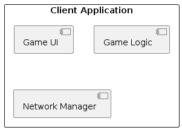

# Client application

## Functional requirements coverage

| Functional requirement             | Game UI | Network manager | Game logic|
|-----------------------------------------|---------|-----------------|------------|
| Top-down 2D view                        |    ✓    |                 |     |
| Character lock on camera                |    ✓    |                 |     |
| Match-based gameplay                    |    ✓    |        ✓        |      ✓|
| Character creation                      |    ✓    |        ✓        |      ✓|
| Skill synergy                           |    ✓    |        ✓        |      ✓|
| PvPvE gameplay                          |         |      ✓          |       ✓|
| Intelligent bots                        |          |      ✓         |     ✓|
| Interactive environment                 |    ✓    |        ✓        |      ✓|
| End-game statistics                     |    ✓    |        ✓        |      ✓|
| Monitoring statistics throughout the game |    ✓    |        ✓        |      ✓|
| Controller support (Optional)           |    ✓    |                 |        |

## Responsibilities and interactions

### Game UI

- **Responsibilities**: Provides the user interface for players, including
  menus, in-game HUD, and end-game statistics.
- **Interactions**: Receives input from players and displays game state information.

### Network manager

- **Responsibilities**: Manages communication with the Game Server, ensuring
  real-time updates.
- **Interactions**: Sends player actions to the server and receives game state updates.

### Game logic

- **Responsibilities**: Processes user inputs, updates the game state locally,
  and synchronizes with the server.
- **Interactions**: Interacts with both the Game UI and Network Manager to
  maintain game state.
