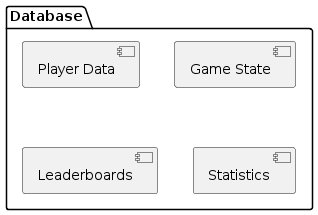

# Database

## Functional requirements coverage

| Functional requirement                  | Player data | Game state | Leaderboards|
|-----------------------------------------|-------------|------------|--------------|
| Character creation                      |      ✓      |            |          |
| End-game statistics                     |      ✓      |      ✓     |       ✓|
| Monitoring statistics throughout the game |  ✓         |      ✓     |       ✓|

## Responsibilities and interactions

### Player data

- **Responsibilities**: Stores player profiles, authentication data, and
  statistics.
- **Interactions**: Interacts with Game Server to read/write player-related data.

### Game state

- **Responsibilities**: Saves the current state of ongoing games for
  synchronization and recovery.
- **Interactions**: Interacts with Game Server to maintain game state consistency.

### Leaderboards

- **Responsibilities**: Tracks player rankings and scores.
- **Interactions**: Interacts with Game Server to update and retrieve
  leaderboard data.
