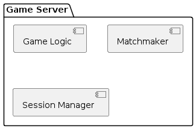

# Game server

## Functional requirements coverage

| Functional requirement| Matchmaker| Session manager | Game logic |
|-----------------------------------------|------------|-----------------|--|
| Multiplayer support                     |     ✓       |                 | |
| Match-based gameplay                    |            |        ✓        | ✓|
| Character creation                      |            |                 |✓|
| Skill synergy                           |            |                 |✓|
| PvPvE gameplay                          |            |        ✓        |✓|
| Intelligent bots                        |            |                 |✓|
| Interactive environment                 |            |         ✓      |✓|
| End-game statistics                     |            |                 |✓|
| Monitoring statistics throughout the game |            |                |✓|

## Responsibilities and interactions

### Matchmaker

- **Responsibilities**: Manages player matchmaking, pairs players.
- **Interactions**: Communicates with the Session Manager to create new game sessions.

### Session manager

- **Responsibilities**: Handles the creation, management, and termination of
  game sessions.
- **Interactions**: Works with the Matchmaker and Game Logic to manage active sessions.

### Game logic

- **Responsibilities**: Implements game rules, processes game events, and
  ensures state synchronization between clients.
- **Interactions**: Interacts with the Session Manager and Database to maintain
  game state.
